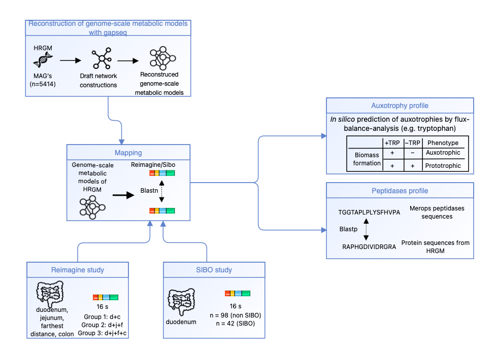
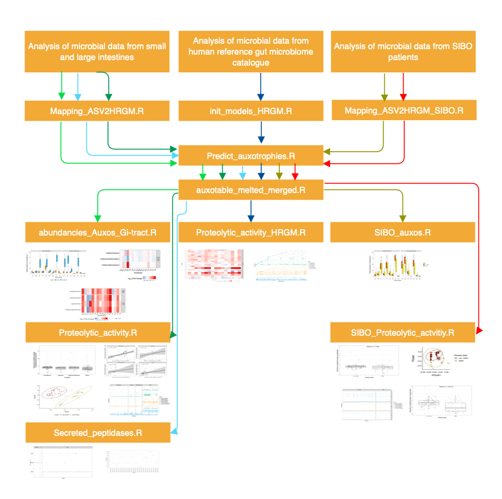

<h1 align = "center" >Comparison of auxotrophy and peptidase profiles of the microbiota in the gastrointestinal tract </h1>

## Project idea
The nutritional environment varies in the gastrointestinal tract. In the small intestine, protein digestion takes place and broken-down amino acids are absorbed. Therefore, the dietary proteinaceous environment is rather poor for the microbiome in the large intestine. However, there are other protein sources such as enzymes of bacterial and human origin which could display especially a protein source for the microbiome residing in lower parts of the gastrointestinal tract (Figure 1). Proteins display a vital nutrient source for bacteria because amino acids are needed for the biosynthesis of cellular proteins. Prototrophic bacteria are able for the de novo biosynthesis of amino acids but auxotrophic bacteria are not and rely therefore on their nutritional environment. Previously we predicted auxotrophy frequencies in the large intestinal microbiota and found auxotrophies in higher freqencies esepcially for human essential amino acids. In addition, we found a positive association between auxotrophy frequencies and the diversity as well as long-term stability (https://doi.org/10.1101/2023.03.23.532984). The objective of this study is therefore to compare auxotrophy frequencies of the microbiota from the small intestine and large intestine. Because the microbial proteolytic activity in the human gut could lead to a higher availability of amino acids in the environment, we predicted the peptidase profile and statistically examined the relationship between the frequencies of peptidases and auxotrophies. Further, the auxotrophy and peptidase profiles are determined in dysbiosis state of the small intestine (SIBO).

<tr><td align="center" width="9999" border =  "0 px%">

</td></tr>

Figure 1: Availability of protein sources and free amino acids in different locations of the gastrointestinal tract 

## Workflow of the study
The workflow of the study is displayed below. 16s sequences from two studies (Reimagine, SIBO) were mapped on genomes from the HRGM catalogue which represents microbial species found in the human gut microbiome. Auxotrophies were predicted with genome-scale metabolic modeling by comparing the microbial growth with and without the focal amino acid in the environment. The models were reconstructed with gapseq and can be found on zenodo: 10.5281/zenodo.7645465. Peptidases were predicted by scanning the translated protein sequences from the mapped nucletoide sequences of the two studies to available peptidase sequences from the MEROPS database. 

<tr><td align="center" width="9999" border =  "0 px%">

</td></tr>

Figure 2: Workflow of the study,free available icons were taken from www.flaticon.com (creators: surang, Icon home Eucalyp, Kiranshastry, Becris) 

## Instruction for running the scripts 
The scripts can be runned in Rstudio. The order of the scripts can be seen in the figure below. For each new analysis process, the contents of the environment should be deleted beforehand.

<tr><td align="center" width="9999" border =  "0 px%">

</td></tr>

Figure 2: Order for running the scripts 

